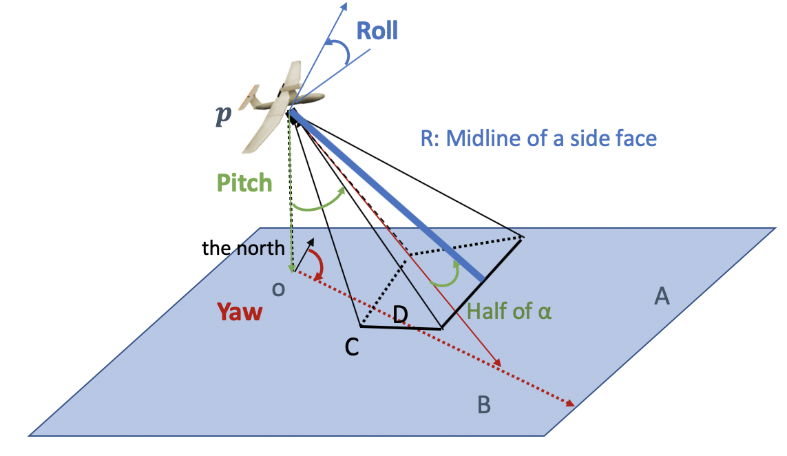
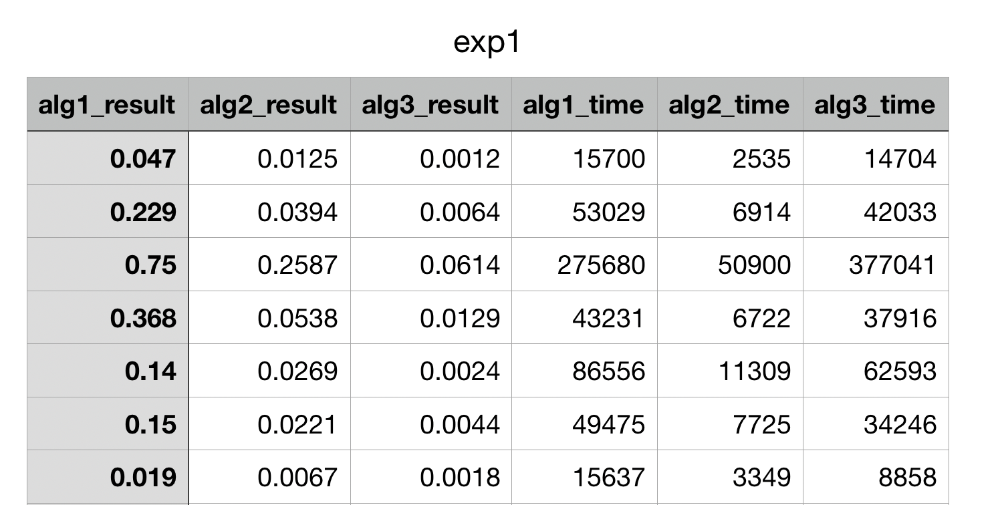

# 3D Spatial Coverage Measurement of Aerial Images

This repository contains source code and experimental result for paper *3D Spatial Coverage Measurement of Aerial Images*.

Link to the paper: **to do**

This project focus on generating massive experimental results for a large number of queries, thus validating our models. For a visualization of specific cases, please refer to another repository for our demo paper:

https://github.com/mazeyu/3D_Spatial_Coverage_Model_Demo

## Prerequisite
This repository contains two parts: Python code in folder **Python code** and remaining C++ code.

The C++ code doesn't depend on any libraries.
The Python code depends a few common libraries: **scipy, pickle, pandas and numpy**, and is tested on **Python3**. Besides, it depends on an 3D Geometry Operation Library called **pycsg** (Constructive Solid Geometry), which is contained in the code.

## Datasets

As mentioned in our paper, we use two real dataset, and we have extracted and converted the information we need into two csv files, **dataset_small.csv** and **dataset_small.csv**.

 All of them contains 7 columns: lat, lng, hgt, yaw, pitch, roll, t. If you want to generate your own dataset, please make sure to use this format.

## Formulation of the Problem

### Definition of Aerial Field of View
Given an aerial image Ij, the aerial field of view fj is represented by the eight parameters acquired at the image capturing time, fj ≡ ⟨lat,lng,hgt,θy,θp,θr,α,R⟩, where lat and lng are the GPS coordinates (i.e., latitude and longitude) of the camera location, hgt is the camera height with respect to the ground, θy, θp, and θr are three rotation angles of the camera pose (θy is the yaw angle rotating around the vertical axis, θp is the pitch angle rotating around the lateral axis, θr is the roll angle rotating around the longitudinal axis), α is the camera visible angle, and R is the maximum visible distance.
### Problem Description
Given a dataset F and a query region in 3D space Rq (e.g., a cubic region), the 3D spatial coverage measurement problem is formulated as calculating the geo-awareness percentage of F to the visual space located in Rq.

## Usage
Do the following to compile the code.
~~~
mkdir build
cd build
cmake ..
make -j
~~~
We assume your executive files are in sub-folder **build**.

###Evaluation of Monte-Carlo Algorithm
We proposed Monte-Carlo Algorithm in our paper, to validate its efficiency, we need to use pure geometry operation in comparison, which is implemented using Python library pycsg. This is why we need Python.
Since it will take too much time to finish pure geometric operations on ECM and WCM, we only show the case of VCM. But it will still take several hours.

 Running the code **algorithm.py** will generate two files each containing the results of 100 queries and the execution time. Then running the code **process.py** can generate an csv file to compare them. For users' convenience, we provide the experiment result in file **exp_MC.csv**.
 
 Also note that to run the Monte-Carlo Algorithm more efficiently, the Python code relies on the executive file generate by the C++ code which we assume you have generated in the folder **build**.
 
 

###Evaluation of other experiment
Other experiments do not involve pure geometry computation so can be done with pure C++ code.

In folder **experiments/configuration files**, you can see many files like this:
~~~
title: exp1
dataset: ../dataset_small.csv
alg: 1, 2, 3
angles: 0, 8, 8
cells: 0, 0, 8
R: 50
alpha: 45
cubeSize: 100
names: alg1, alg2, alg3
num: 100
~~~
 
* **title** means the file name of the result of the experiment.
* **dataset** specifies which dataset to use.
* The following fields **alg, angles, cells** is viewed as a whole. If they have three values each, it means three individual sub-experiment in this experiment. (alg1 is VCM; alg2 is ECM, alg3 is WCM)
* **R** is the visible distance of FOV.
* **alpha** is the visible angle of FOV.
* **cubeSize** is the size of the query cube. All of these can have several values, but only one of them can simultaneously, since the experiment only varies one parameter at a time.
* **names** are the name of each sub-experiment.
* **num** is number of queries.

After specifying all parameters. Run the command:
~~~
    ./main "../experiments/configuration files/exp1.txt"
~~~
And you will find the experiment result file, **exp1.csv** in this example. It is like this:

Another file **query_exp1.txt** is also generated in accompany. For user's convenience, most experiment results mentioned in the paper are contained in the folder **experiment**. (one or two other experements requires change of macro in source code, so we will omit it here)

    

 

## Citation

If you used this code for your experiments or found it helpful, consider citing the following paper:

~~~
~~~
